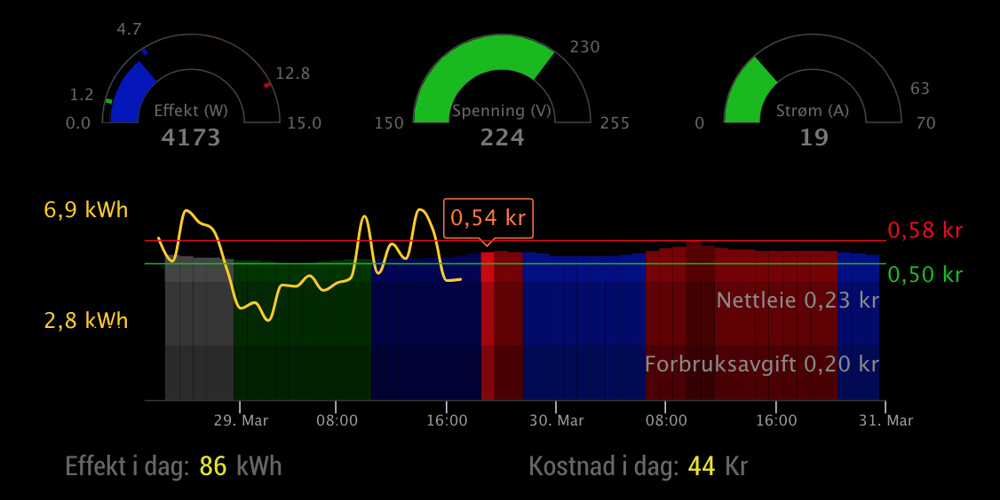
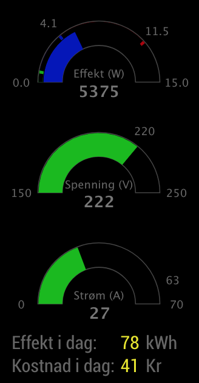
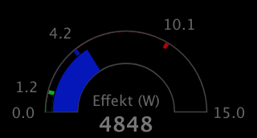
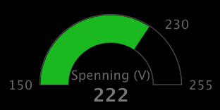
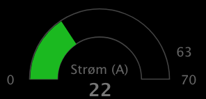

# MMM Tibber

Module for [MagicMirror](https://github.com/MichMich/MagicMirror/) showing electricity related data from Tibber, such as:

- Current power consumption, voltage or current
- Current price, and price per hour for this and the next day
- Total consumption and total cost today
- Minimum and maximum power consumption today
- Historical power consumption per hour

## Screenshot

Standard screen:



The price curve was a bit boring the day I took this screenshot, and also, after 13:00 it normally shows the prices for the next day too.

Gauges 3-phase:


Vertical Gauges:



## Installation

Go to your `MagicMirror/modules` folder and write

    git clone https://github.com/ottopaulsen/MMM-Tibber
    cd MMM-Tibber
    npm install

## Configuration

Here is an example configuration. Put it in the `MagicMirror/config/config.js` file:

```javascript
{
    module: 'MMM-Tibber',
    position: 'bottom_center',
    config: {
        tibberToken: '<find your token from tibber.com>'
    }
},
```

Of course, you need a [Tibber](https://tibber.com/) account to use this module. Your access token (`tibberToken`) can be found in the [developer pages](https://developer.tibber.com/settings/accesstoken).

If you have more than one Tibber subscription (for example several houses), you must use the houseNumber config variable to set correct house number. You can turn on logging (`logging: true`) and watch the output from the node_helper in the terminal window to check the address of the configured house.

The above is the minimum configuration required. Here is the complete module configuration you can use, with default values:

```javascript
config: {
  // General
  tibberToken: "log in to tibber to find your token",
  houseNumber: 0, // If you have more than one Tibber subscription
  logging: false, // Turn on to see more details, but keep normally off
  is3phase: false, // Set to true to force 3-phase
  // Chart
  historyHours: 24, // How long history for price and consumption to see in the graph
  futureHours: 48, // How long into the future to see price data
  xAxisLineColor: "#333333",
  xAxisLabelColor: "#999999",
  adjustLeftMargin: 0, // Pixels to adjust margin
  adjustRightMargin: 0,
  adjustTopMargin: 0,
  graphWidth: null, // Uses available width by default
  graphHeight: 200,
  // Price curve
  showPrice: true,
  priceChartType: "column", // column, line or spline
  priceLineWidth: 3, // For line and spline, not column
  priceColor: "#cc0000", // For line and spline
  priceColumnColors: {
    // Only for column chart type
    NORMAL: ["#000055", "#0000dd", "#000088"], // Blue
    VERY_CHEAP: ["#004400", "#00dd00", "#008800"], // Lighter green
    CHEAP: ["#003300", "#00bb00", "#006600"], // Green
    EXPENSIVE: ["#440000", "#cc0000", "#770000"], // Red
    VERY_EXPENSIVE: ["#440000", "#aa0000", "#550000"], // Darker red
    UNKNOWN: ["#444444", "#444444", "#444444"] // Gray
  },
  // Consumption curve
  showConsumption: true,
  consumptionChartType: "spline", // column, line or spline
  consumptionLineWidth: 2, // For line and spline
  consumptionColor: "#ffcc00", // For line and spline
  consumptionDecimals: 1,
  // Price label and min/max price text
  priceUnit: "kr",
  decimalSeparator: ",",
  graphLabelFontSize: 16,
  priceDecimals: 2,
  showCurrentPrice: true,
  curPriceColor: "#ff7733",
  // Min and Max price lines
  showMinPrice: true,
  showMaxPrice: true,
  minPriceLineWidth: 1,
  maxPriceLineWidth: 1,
  minPriceColor: "#00bb00",
  maxPriceColor: "#ee0000",
  adjustPriceLabelsX: 0, // Adjust position sideways in pixels (pos or neg)
  // Min/Max consumption labels
  showMinConsumption: true,
  showMaxConsumption: true,
  adjustConsumptionLabelsX: 0, // Adjust position sideways in pixels (pos or neg)
  // Additional costs
  additionalCostPerKWH: [],
  showAdditionalCostsGraph: true,
  additionalCostsLabelColor: "#888888",
  additionalCostsLabelAdjustX: 0, // Adjust label position
  additionalCostsLabelAdjustY: 0, // Adjust label position
  includeAdditionalCostsInPrice: true,
  // Power gauge
  showPowerGauge: true,
  powerGaugeMaxValue: null, // Max gauge value. Calculated by default.
  powerGaugeMarkSize: 20, // Size of marks in % of sector area
  powerGaugeMinTickColor: "#00AA00",
  powerGaugeAvgTickColor: "#0000AA",
  powerGaugeMaxTickColor: "#AA0000",
  powerGaugeTitle: "",
  powerGaugeDynamicColors: true,
  orangePercentOfAvg: 120,
  redPowerPercentOfMax: 85,
  redPowerPercentOfAvg: 200,
  powerGaugeColors: [
    // Colors for the graph
    { fromValue: 0, color: "#00BB00" },
    { fromValue: 5000, color: "#e68a00" },
    { fromValue: 7000, color: "#BB0000" }
  ],
  // Voltage gauge
  showVoltageGauge: true,
  voltageGaugeName: "voltage",
  voltageGaugeTitle: "",
  voltageGaugeNominalValue: 230,
  voltageGaugeMaxValue: 255,
  voltageGaugeMinValue: 150,
  voltageGaugeColors: [
    // Colors for the graph
    { fromValue: 0, color: "#BB0000" },
    { fromValue: 207, color: "#0000BB" },
    { fromValue: 220, color: "#00BB00" },
    { fromValue: 240, color: "#0000BB" },
    { fromValue: 253, color: "#BB0000" }
  ],
  // Current gauge
  showCurrentGauge: true,
  currentGaugeName: "current",
  currentGaugeTitle: "",
  currentGaugeNominalValue: 63, // Main fuse
  currentGaugeMaxValue: 70,
  currentGaugeMinValue: 0,
  currentGaugeColors: [
    // Colors for the graph
    { fromValue: 0, color: "#00BB00" },
    { fromValue: 50, color: "#e68a00" },
    { fromValue: 61, color: "#BB0000" }
  ],
  // Gauges common
  gaugesVertical: false, // Set true to show gauges vertically
  gaugesAbove: true, // Set false to have gauges below the graph
  gaugesWidth: 230,
  gaugesHeight: 120,
  gaugesValueFontSize: 17,
  gaugesValueFontSize3phase: 14,
  gaugesValueDistanceAdjustment: 0,
  gaugesLabelFontSize: 12,
  gaugesTitleFontSize: 12,
  // Table data
  showTable: true,
  tableVertical: false,
  tableWidth: null,
  accumulatedPowerUnit: "kWh",
  accumulatedCostCurrency: "Kr",
  tableLabelColor: "#666666",
  tableValueColor: "#e6e600"
}
```

The `futureHours` max value is 48, but it cannot show more than the whole next day. Also, the next day is not available until some time during the day, normally around 13:00, but it varies.

### Multiple module instances

You can configure multiple instances of the module to show different parts on different places of the screen. The Tibber token and the house number must be the same for all modules. Logging should also be the same, or if not, the logging from the node_modules.js file is random on or off.

Use the showXXX variables to hide different parts of the module. For example, you can show the price and consumption chart in a wide area of the screen, and show the gauges for power, voltage and current vertically in a narrow part of the screen. The text table also looks best vertically.

### Show/hide parts

You can hide those parts of the module that you dont want to see, for example:

| Variable                 | Description                                                                                                                            |
| ------------------------ | -------------------------------------------------------------------------------------------------------------------------------------- |
| showPrice                | The price graph                                                                                                                        |
| showConsumption          | The consumption graph                                                                                                                  |
| showCurrentPrice         | The label near the middle of the graph showing price right now                                                                         |
| showMinPrice             | The line and label showing minimum price in the graph                                                                                  |
| showMaxPrice             | The line and label showing maximum price in the graph                                                                                  |
| showMinConsumption       | The label showing minimum consumption in the graph                                                                                     |
| showMaxConsumption       | The label showing maximum consumption in the graph                                                                                     |
| showAdditionalCostsGraph | The part of the price graph for the additional costs. NB! Additional costs must be configured using the additionalCostPerKWH variable. |
| showPowerGauge           | The gauge showing power consumption right now                                                                                          |
| showVoltageGauge         | The gauge showing voltage right now                                                                                                    |
| showCurrentGauge         | The gauge showing current right now                                                                                                    |
| showTable                | The table with total cost and total consumption today                                                                                  |

You can hide each part by setting the config variable to `false`.

### Include additional costs

Normally the electricity cost received from Tibber is only a fraction of the total electricity cost. You can add additional costs to show real costs. Example:

```
    additionalCostPerKWH: [
      {
        label: "Nettleie",
        price: 0.23125
      },
      {
        label: "Forbruksavgift",
        price: 0.20163
      }
    ],
```

This will give you a graph like in the main screenshot above.

If you want to include the additional costs in the price lables, but you dont like to see the additional costs in the graphs, you can hide them by setting the `showAdditionalCostsGraph` config variable to false. This will give you a graph like this:


### The gauges

#### Power gauge



The power gauge shows current power consumption, and is updated every other second or more. It has some tiny marks showing minimum and maximum consumptions today, as well as average consumption. You can change the size of those marks using the `powerGaugeMarkSize` variable, that can be set between 0 and 100. If you set it to 0, they will not be visible. If you set them to 100, the current power meter will not be visible, only the label.

You can configure colors for the gauge for different value zones using the `powerGaugeColors` config variable. By default, the color zones are dynamic as follows:

- Power less than average: The first color is used (default green).
- Power over "orangePowerPercentOfAvg" percent of average (default 120%), less than "red power" (see below): The second color is used (default orange).
- Power over "red power": The third color is used (default red).

By "red power" means power larger then redPowerPercentOfMax percent (default 85%) of maximum power or larger than redPowerPercentOfAvg percent (default 200%) of average power. The percentages can be changed by config. Dynamic power colors can be turned off by setting powerGaugeDynamicColors to false.

For dynamic colors to work, there must be at least 3 colors in powerGaugeColors (ony 3 are used). Else there must be at least one color.

The maximum value of the gauge is set automatically based on the nominal value of the voltage and the current by multiplying those, and rounding up. This is correct only for 1-phase, so you can override the maximum value using the powerGaugeMaxValue config variable.

#### Voltage gauge



The voltage gauge shows the current voltage, and is updated every 10 seconds (this actually varies). It automatically detects if you have 3 phases, and if so, shows voltage per phase. If you have anything other than 230V, you should change the `voltageGaugeNominalValue` config variable accordingly, and then you would probably also adjust the `voltageGaugeColors` values. These are by default set to show red if the value is outside the 10% that is the official requirement in Norway, and blue if they are >10V away from 230. You can also change the minimum and maximum values for tha gauge.

#### Current gauge



The current gauge shows the current current (hmmm), and is updated every 10 seconds. It automatically detects if you have 3 phases, and if so, shows current per phase.

NB! You should set the `currentGaugeNominalValue` config variable to the value of your main fuse. You should also adjust the `currentGaugeColors` table so it shows red when current is close to the fuse value, and maybe also adjust the other color values.

#### Common gauge configurations

There are some configuration values common for all gauges, adjusting size of the gauges and the fonts.

With the `gaugesValueDistanceAdjustment` config variable you can increase or decrease (-) the distance between the voltage and current values for 3-phase meterings.

Set `gaugesVertical` to true if you want to show tha gauges vertically. In this case you probably would hide the price and consumption graphs, and have them in another instance of the module.

## Translations

There are a few words that need translations, and I have provided translations for English (default), Norwegian and Swedish. You must set the `language` config variable for MagicMirror (not the module) to either `no` or `se` to get the right language.

## Troubleshooting

If something is not working, turn on logging by setting the config variable `logging` to `true`, and look at the data you receive from Tibber.

If you for example cannot see the voltage gauge, it may be because you get no voltage data from Tibber. NB! Voltage and current data does not necessarily come on all updates, so watch at least 10 seconds.

If you cannot se 3-phase gauges for voltage and current, and you know you get data for 3 phases, try to set the `is3phase` config variable to true to override the automagic.

## Bug reports

If you find a bug or have an improvement suggestions, please create a Github issue.

## Contributions

Contributions are welcome. Please create a github issue first, so we can dicuss the change before you make it. Create a pull request when you have a change to submit.

<hr/>

Here are my other [modules for MagicMirror](https://github.com/ottopaulsen/magic).
